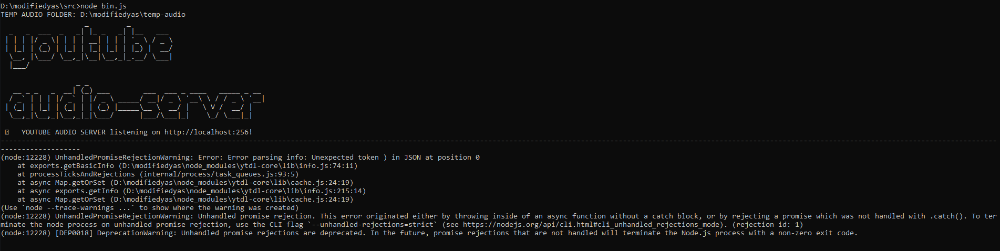

## Original repo
https://github.com/codealchemist/youtube-audio-server
You can follow the installation guide here.

## Disclaimer
We are not the original creators of this repo and dont intent to sell the code. We just needed a selfcontrolled Repo for our project.

# Fixes to common errors
## JSON error in ytdl-core 
In short this error means that your ytdl-core is outdated. Google changes their JSON structure from time to time wich leads to the ytdl-core needing to update every so often.

If you get this error follow the following steps:
  - Remove folder /node_modules/ytdl-core
  - either change version in package.json to the latsest and run npm i or use npm i ytdl-core in modifiedyas folder
  
Link to ytdl-core: https://www.npmjs.com/package/ytdl-core/

# implementation in Project heartbeat
https://github.com/bryanvolckaertschool/Projectheartbeats

youtube-audio-server can be used for a variety of applications but we use it to create an on demand mp3 stream of the requested youtube ID.
We store our song ID's in our database as explained in the README in the main repo.
The link to this mp3 stream is then passed on to the google cast capable speaker who plays the .mp3 stream.

# what's different from the original repo?
Since you have to provide a url/id.mp3 to the speaker we needed to modify the code to accept the .mp3 in the url of the request.
If you try this in the original repo you will get and error wich comes down to: 'cant find song with id: "hypothetical id".mp3'

